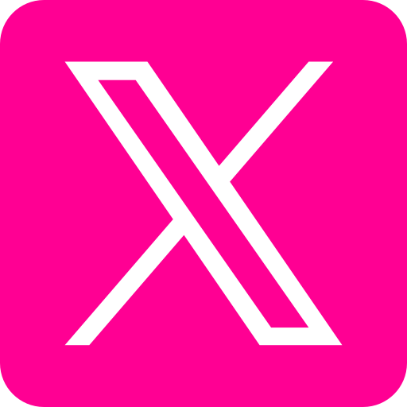
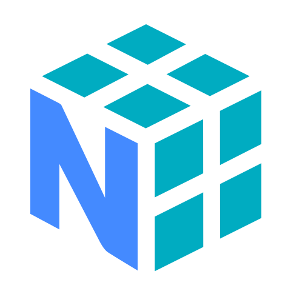
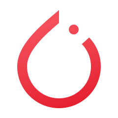
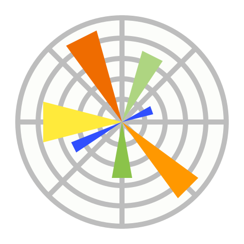
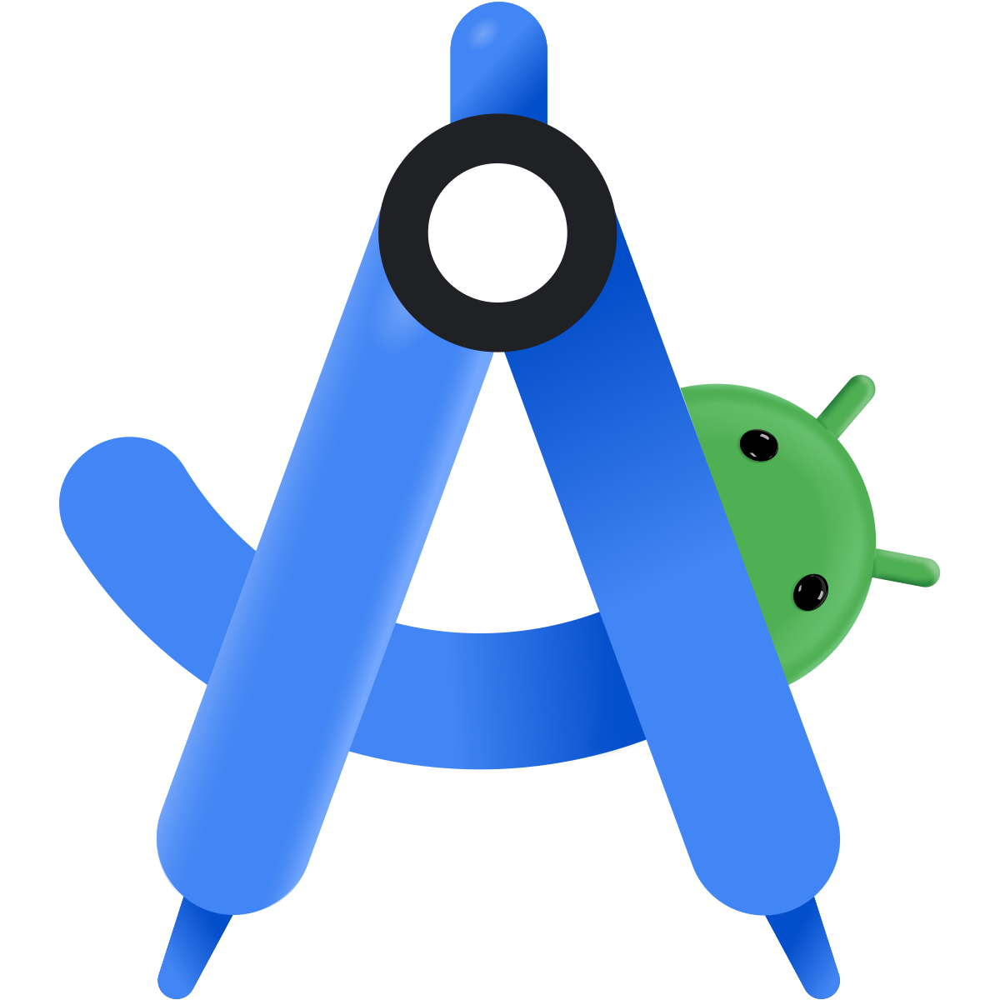
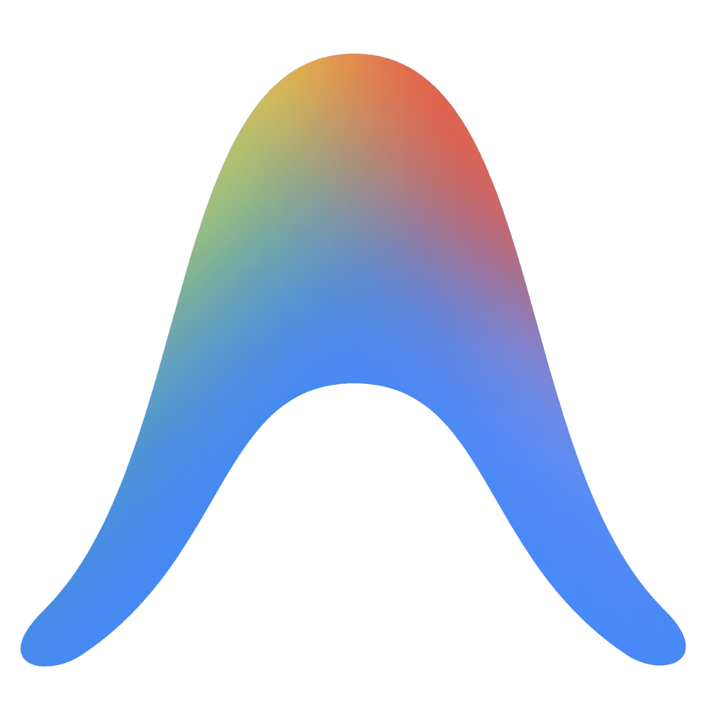

    

<!--- Adding Header Elements -->

    &nbsp;&nbsp;&nbsp;&nbsp;
    &nbsp;&nbsp;&nbsp;&nbsp;
    &nbsp;&nbsp;&nbsp;&nbsp;
    &nbsp;&nbsp;
    &nbsp;&nbsp;
    <a href="https://x.com/Ahtisham1214">
        

 

**💻Tech Stack:**  

<b>Languages:</b>&nbsp;&nbsp;&nbsp;
    &nbsp;&nbsp;
    &nbsp;&nbsp;
    &nbsp;&nbsp;
    &nbsp;&nbsp;
    &nbsp;&nbsp;
    &nbsp;&nbsp;
    &nbsp;&nbsp;
    &nbsp;&nbsp;
       
<b>Libraries & Frameworks:</b>&nbsp;&nbsp;&nbsp;
    &nbsp;&nbsp;
    &nbsp;&nbsp;
    &nbsp;&nbsp;
    &nbsp;&nbsp;
    &nbsp;&nbsp;
    &nbsp;&nbsp;
    &nbsp;&nbsp;
    &nbsp;&nbsp;
    &nbsp;&nbsp;
       
    <b>Tools & Platforms:</b>&nbsp;&nbsp;&nbsp;
    &nbsp;&nbsp;
    &nbsp;&nbsp;
    &nbsp;&nbsp;
    &nbsp;&nbsp;
    &nbsp;&nbsp;
    &nbsp;&nbsp;
    &nbsp;&nbsp;
    &nbsp;&nbsp;
    &nbsp;&nbsp;
    &nbsp;&nbsp;
    &nbsp;&nbsp;
    &nbsp;&nbsp;
    &nbsp;&nbsp;
    &nbsp;&nbsp;
    &nbsp;&nbsp;
    &nbsp;&nbsp;
    &nbsp;&nbsp;
    &nbsp;&nbsp;
       
    &nbsp;&nbsp;&nbsp;<b>Databases :</b>&nbsp;&nbsp;&nbsp;

  

<h2 style="color:#e8df7a; display: flex; align-items: center;">
    
        LeetCode Stats:
</h2>

    
     
    

<h2 style="color:#e8df7a; display: flex; align-items: center;">
    
        GitHub Stats:
</h2>

     
     
     
    
    
    

     
    

<h3 style="color:#e8df7a;">✍️ Random Dev Quote</h3>

&nbsp;&nbsp;&nbsp;&nbsp;&nbsp;&nbsp;&nbsp;&nbsp;&nbsp;&nbsp;&nbsp;&nbsp;&nbsp;&nbsp;&nbsp;&nbsp;&nbsp;&nbsp;&nbsp;&nbsp;&nbsp;&nbsp;&nbsp;&nbsp;&nbsp;&nbsp;&nbsp;&nbsp;&nbsp;&nbsp;&nbsp;&nbsp;&nbsp;&nbsp;&nbsp;&nbsp;&nbsp;&nbsp;&nbsp;&nbsp;&nbsp;&nbsp;&nbsp;&nbsp;&nbsp;&nbsp;&nbsp;&nbsp;&nbsp;&nbsp;&nbsp;&nbsp;&nbsp;&nbsp;&nbsp;&nbsp;&nbsp;&nbsp;&nbsp;&nbsp;&nbsp;&nbsp;&nbsp;&nbsp;&nbsp;&nbsp;&nbsp;&nbsp;&nbsp;&nbsp;&nbsp;&nbsp;&nbsp;&nbsp;&nbsp;&nbsp;&nbsp;&nbsp;&nbsp;&nbsp;&nbsp;&nbsp;&nbsp;&nbsp;&nbsp;&nbsp;&nbsp;&nbsp;&nbsp;&nbsp;&nbsp;&nbsp;&nbsp;&nbsp;&nbsp;&nbsp;&nbsp;&nbsp;&nbsp;&nbsp;&nbsp;&nbsp;&nbsp;&nbsp;&nbsp;&nbsp;&nbsp;&nbsp;&nbsp;&nbsp;&nbsp;&nbsp;

